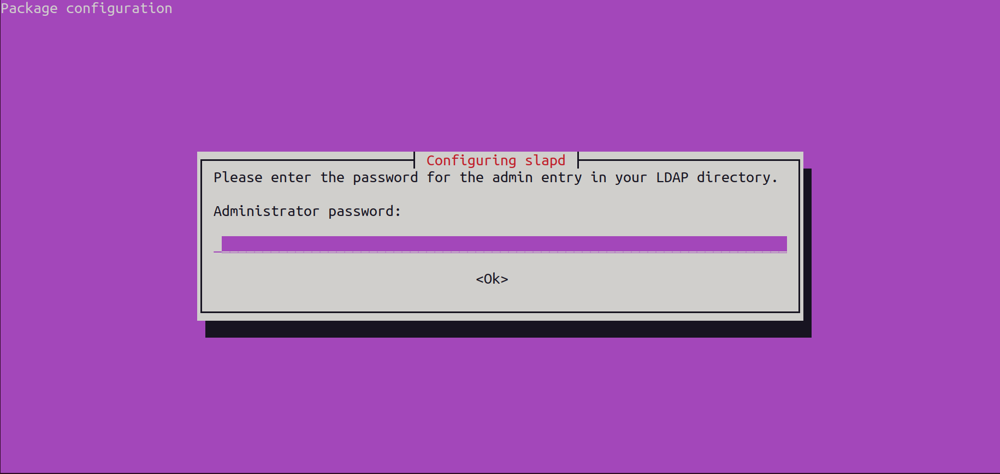

# Authentication with OpenLDAP, SSH, Apache, OpenVPN

## Section 1: OpenLDAP Configuration

### 1.1 Configure an OpenLDAP server with at least two users and two groups.

1. Installation of Dependencies:
    
    

2. Adding an Admin Password:

    

3. Installation of LAM: 

    LDAP ACCOUNT MANAGER: Graphical Interface for Server Management;

    All configurations have been done using LAM.
    

    Enable PHP CGI PHP Extension: 
    

4. Starting the Configuration:
   
    1. Access to `192.168.56.101.lam`; access to the LAM interface.
    2. Begin the configuration with LAM Configuration.
    3. Change the base DC to `dc=mon-projet, dc=tn`.
    4. Change the manager's name, considering the new configuration (`cn=admin,dc=mon-projet,dc=tn`).
    5. Change the default password (lam).
    6. Change the suffix used by Tree to visualize the DIT (Directory Information Tree).

    .png)
    .png)

    7. Log in as Admin and Add Users and Groups, Considering the New Configurations:
   
    .png)
    .png)

### 1.2 Add information of your choice, including the x509 certificate, for all users.

1. Create Certificates for Both Users and Link Them, Also Using LAM:
.png)
.png)
.png)
.png)

1. Viewing the DIT (Directory Information Tree):

.png)

### 1.3 Ensure that users can authenticate successfully on the OpenLDAP server.

#### Client Machine Configuration:

1. First, check the status of the server: 
   .png)
2. Retrieve its IP address: 
   .png)
3. Add the server's IP address to the client machine to avoid errors in /etc/hosts: 
   .png)
4. Verify the client's connectivity to the server through a ping: 
   .png)
5. Install client dependencies: libnss-ldap, libpam-ldap, ldap-utils, nscd
6. During the installation, a configuration window appears: 
   .png)
7. Add the server configurations, including the address, admin password, distinguished name (DN), version, etc.
8. Configure the file /etc/nsswitch.conf as follows: 
   .png)
9.  Configure the file /etc/pam.d/common-password as follows:
    .png)
10. Configure the file /etc/pam.d/common-session as follows: 
    .png)
11. Restart nscd: 
    .png)
12. Testing:
    
    - Through the ldapsearch command to retrieve everything:
  .png)
    - Verify the addition of new users and groups, and try to log in: 
  .png)
  .png)
    .png)

### 1.4 Test the secure part of LDAP with LDAPS, and describe the various advantages.

1. Create self-signed certificates for the server: 
.png)

1. Assign ownership to OpenLDAP using the chown command: 
.png)

1. Create an LDIF configuration file: 
.png)

1. Execute changes from the LDIF file: 
.png)

1. Add ldaps:// to the file /etc/default/slapd: 
.png)

.png)

1. Configure the file: /etc/ldap/ldap.conf: 
.png)
1. Restart slapd: 
.png)
1. Test an LDAPS query: 
.png)

## Section 2: SSH Authentication

- The configurations made for the client machine in 1.3 will enable SSH connection: 
.png)
.png)
- Limit access only to the first group:
- Verify that members belong to the associated groups: 
.png)

- Configure /etc/ssh/sshd_config: 
.png)

- Test:
    - SSH possible for nbennejma: 
  .png)

    - SSH impossible for wsboui: 
  .png)

## Section 3: Integration of Apache

- Install dependencies: 
  .png)
  .png)

- Check the Apache2 service: 
  .png)

- Configure the service to allow access only to users from group 3: 
  .png)
  .png)

- Restart Apache2: 
  .png)

- Test access: 
  .png)
  .png)