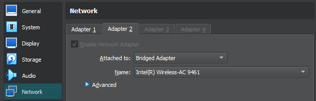
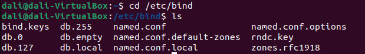
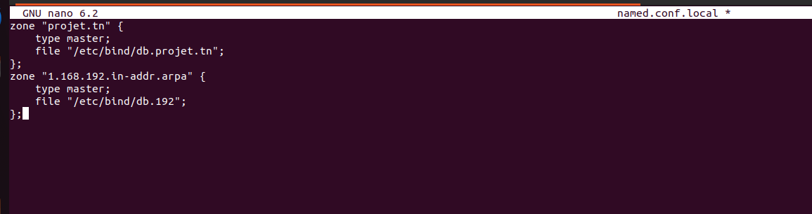
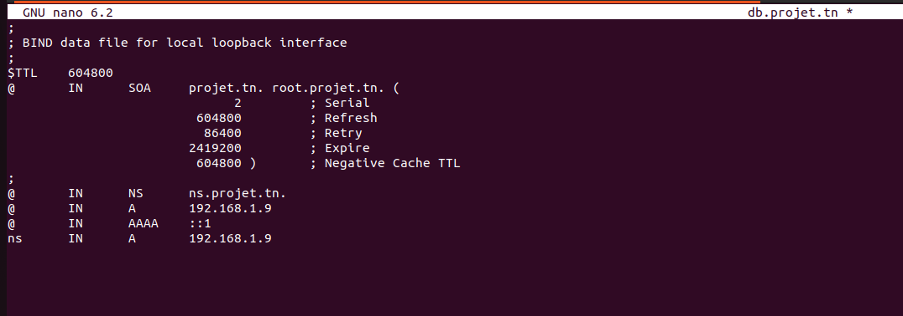
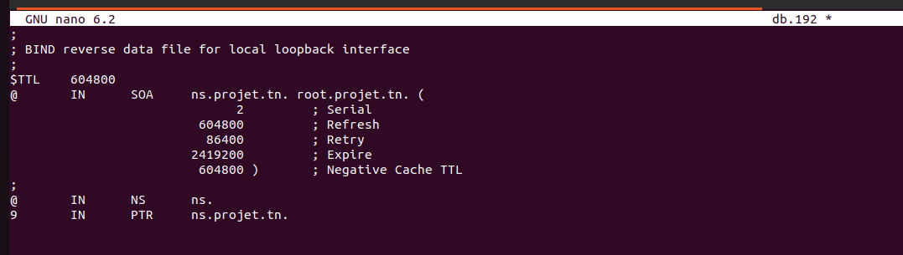
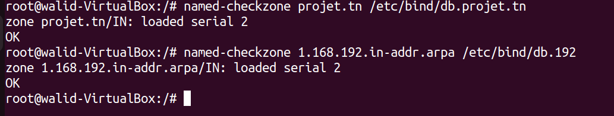
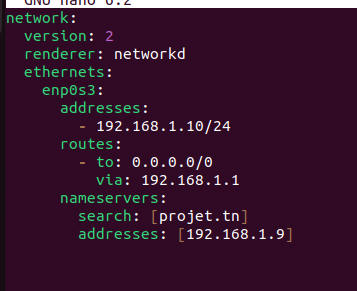
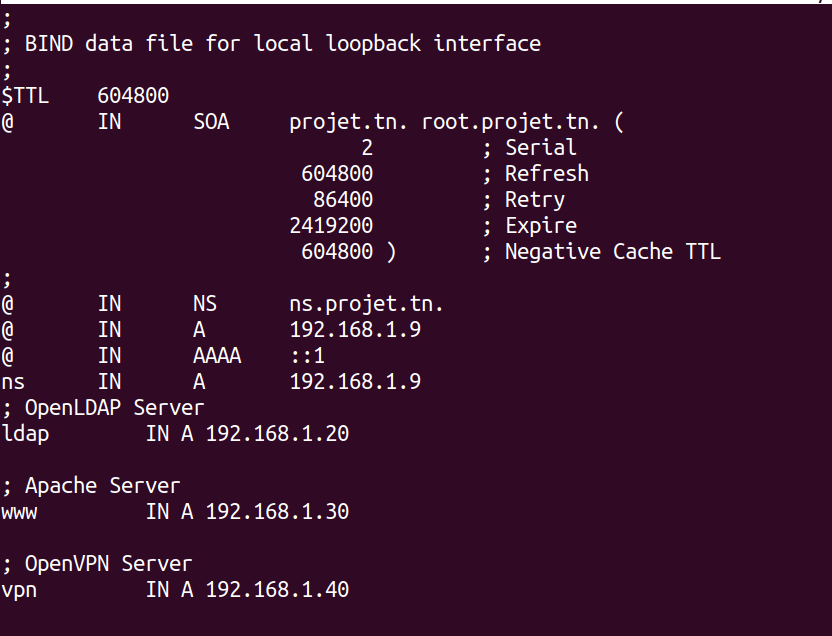
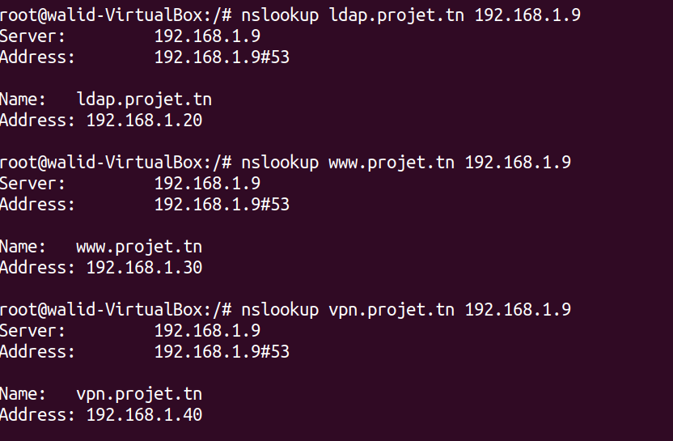

# Managing Network Services with DNS

> Domain Name Service (DNS) is an Internet service that maps IP addresses and fully qualified domain names (FQDN) to one another. In this way, DNS alleviates the need to remember IP addresses. Computers that run DNS are called name servers. Ubuntu ships with BIND (Berkley Internet Naming Daemon), the most common program used for maintaining a name server on Linux.

Source: [Ubuntu Server Guide](https://ubuntu.com/server/docs/service-domain-name-service-dns)

## Section 1: Configuring a DNS server

### 1.1 Configure a DNS server (Bind) on a separate machine.

#### Steps:

1. **VM network settings:**
   
    <details>
    <summary>add network adapter attached to bridged adapter </summary>

    (This enables Oracle VM VirtualBox to intercept data from the physical network and inject data into it, effectively creating a new network interface in software. When a guest is using such a new software interface, it looks to the host system as though the guest were physically connected to the interface using a network cable.)
    Source: [Oracle VM VirtualBox User Manual](https://www.virtualbox.org/manual/ch06.html#network_bridged)

    </details>

    
2. **Installation:**
   
   At a terminal prompt, enter the following command to install dns: 

   `sudo apt install bind9`

   A very useful package for testing and troubleshooting DNS issues is the dnsutils package. Very often these tools will be installed already, but to check and/or install dnsutils enter the following:
   `sudo apt install dnsutils`
3. **Configuration files:**
   
   The DNS configuration files are stored in the /etc/bind directory. The primary configuration file is /etc/bind/named.conf, which in the layout provided by the package just includes these files.
    - `/etc/bind/named.conf.options`: global DNS options
    
    - `/etc/bind/named.conf.local`: for your zones
    
    - `/etc/bind/named.conf.default-zones`: default zones such as localhost, its reverse, and the root hints

    The root nameservers used to be described in the file /etc/bind/db.root. This is now provided instead by the /usr/share/dns/root.hints file shipped with the dns-root-data package, and is referenced in the named.conf.default-zones configuration file above.

   

4. **Forward Zone File configuration:**
   
   a. To add a DNS zone to BIND9, turning BIND9 into a Primary server, first edit `/etc/bind/named.conf.local`:

    ```bash
    zone "projet.tn"
    type master;
    file "/etc/bind/db.projet.tn";
    zone "1.168.192. in-addr arpa" (
    type master;
    file "/etc/bind/db. 192";
    ```

    

    b. Then create the zone file `/etc/bind/db.projet.tn`:

    `sudo cp /etc/bind/db.local /etc/bind/db.example.com`
    ```bash
    ;
    ; BIND data file for local loopback interface
    ;
    $STTL    604800
    @    IN  SOA     projet.tn. root.projet.tn. (
    2       ;Serial
    604800  ;Refresh
    86400   ;Retry
    2419200 ;Expire
    604800) ;Negative Cache TTL
    ;
    @    IN NS  projet.tn.
    @    IN  A  192.168.1.9
    @    IN  AAAA    ::1
    ns    IN  A   192.168.1.9    
    ```
    

5. **Reverse Zone File configuration:**
   
   Now that the zone is setup and resolving names to IP Addresses, a Reverse zone needs to be added to allows DNS to resolve an address to a name.

   Edit `/etc/bind/named.conf.local` and add the following:
   ```bash
   ;
   ;BIND reverse data file for local loopback interface
   ;
   $STTL 604800
   @    IN  SOA     ns.projet.tn. root.projet.tn. (
   2       ;Serial
   604800  ;Refresh
   86400   ;Retry
   2419200 ;Expire
   604800) ;Negative Cache TTL
   ;
   @   IN   NS  ns
   9   IN   PTR ns.projet.tn.
   ```
   
6. **Testing**
   
   1. Restart the bind9 service:
   `sudo systemctl restart bind9.service`

   1. Test the configuration:
   
        ```bash
        named-checkzone projet.tn / etc/bind/db.projet.tn
        named-checkzone 1.168.192. in-addr.arpa /etc/bind/db. 192
        ```

        

   1. DNS client configuration:
        Edit `/etc/resolv.conf` and add the following:
        ```yml
        network:
            version: 2
            renderer: networkd
            ethernets:
                enpOs3:
                    addresses:
                        - 192.168.1.10/24
                    routes:
                        - to: 0.0.0.0/0
                          via: 192.168.1.1
                    nameservers:
                        search: [projet.tn]
                        addresses: [192.168.1.9]
        ```
        

   1. Test the DNS server: `nslookup projet.tn`


### 1.2 Add the necessary DNS records for OpenLDAP, Apache, and OpenVPN.



## Section 2: Validation and Test

### 2.1 Test DNS resolution for each of the configured services.

### 2.2 Ensure that the domain names associated with the services are correctly resolved.

