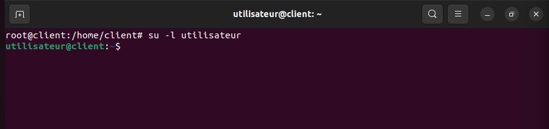
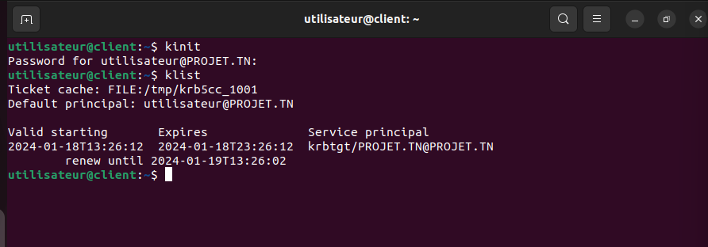

# Authentification with Kerberos


## Section 1: Configuration of the Kerberos Server

### 1.1 Install and configure a Kerberos server.

1. **configure dns server** (see [DNS](../DNS/README.md))

2. **Time Synchronization**
   
    When the client obtains a ticket from Kerberos, it includes in its message the current time of day. One of the three parts of the response from Kerberos is a timestamp issued by the Kerberos server.

    On KDC we install ntp
    `sudo apt install ntp -y`
    Then edit the `/etc/ntp.conf` and add the lines below under the # local users may interrogate the ntp server more closely section:

    ```bash
    restrict 127.0.0.1
    restrict ::1
    restrict 192.168.1.11 mask 255.255.255.0
    nomodify notrap
    server 127.127.1.0 stratum 10
    listen on *
    ```
    On the client we install ntp & ntpupdate:

    `sudo apt install ntp ntpdate -y`

    Then edit the `/etc/ntp.conf` and add the lines below under the # local users may interrogate the ntp server more closely section:

    ```bash
    pool ntp.ubuntu.com
    server 192.168.1.11
    server obelix
    Synchronize the time between server & kdc
    ```
    on the client we run the command below:
    `ntpdate -dv 192.168.1.11`

    
3. **Install Kerberos**
   
    `sudo apt install krb5-kdc krb5-admin-server -y`

    

    

    N.B: decomment the realm in `/etc/krb5kdc/kadm5.acl`
    

### 1.2 Add principals and password policies for users.

1. create principals:
```bash
kadmin.local                              # login as local admin
addprinc root/admin                       # add admin principal
addprinc -randkey host/kdc.projet.tn     # add host principal
ktadd host/kdc.projet.tn                 # generate host principal keytab
```


2. generate principals keytab:
   - Principal : unique identity to which kerberos can assign tickets.
   - keytab : stores long-term keys for one or more principals and allow server applications to accept authentifications from clients, but can alse be used to obtain initial credentials for clients .
  
  
  
  
  
## Section 2: Authentication with a Chosen Service

### 2.1 Choose one of the services (OpenLDAP, SSH, Apache, or OpenVPN) to implement authentication with Kerberos.

When implementing authentication with Kerberos, we have the flexibility to choose a service for integration. In this case, we have chosen SSH (Secure Shell).

### 2.2 Document and configure the chosen service to use Kerberos authentication.

1. SSH Server Configuration:

Open the SSH server configuration file for editing. This is typically located at `/etc/ssh/sshd_config`.

```bash
sudo nano /etc/ssh/sshd_config
```
Add or update the following lines to enable GSSAPI authentication:

```bash
GSSAPIAuthentication yes
GSSAPICleanupCredentials yes
```


Save and exit the editor.

Restart the SSH server to apply the changes:

```bash
sudo systemctl restart ssh
```

Open file `/etc/ssh/ssh_config` for system-wide configuration.
```bash
sudo nano /etc/ssh/ssh_config  
```


**assign keys to principals:**
A keytab file contains long-term secret keys and is used to authenticate a service without requiring user interaction (such as entering a password).


**Add user to test Kerberos authentication with SSH:**


**Test before creating a ticket:**
(password needed)


**create a ticket:**


### bonus (test with a client machine)
- step 1


- step 2


- step 3


- step 4


- step 5


- step 6

